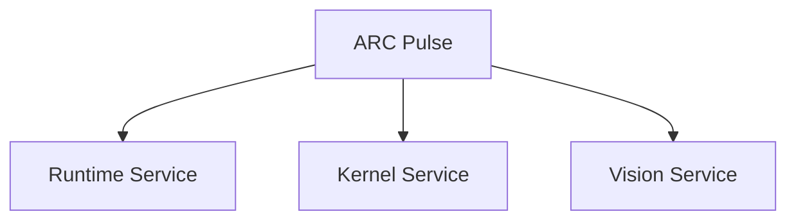
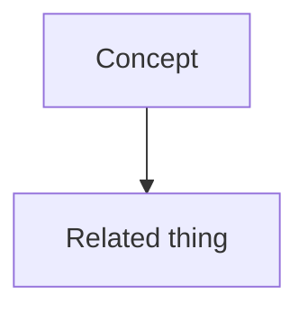
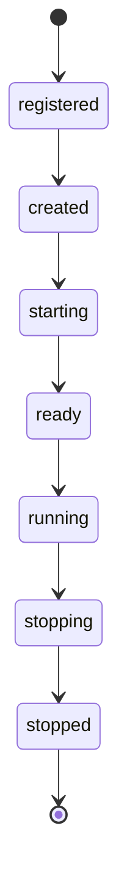
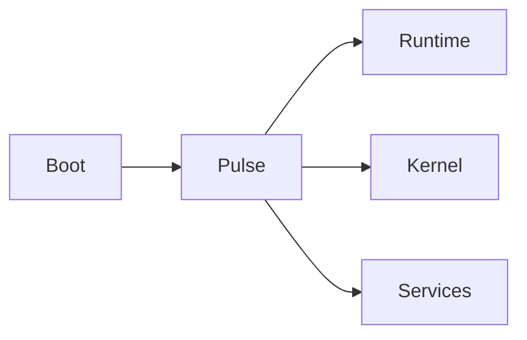
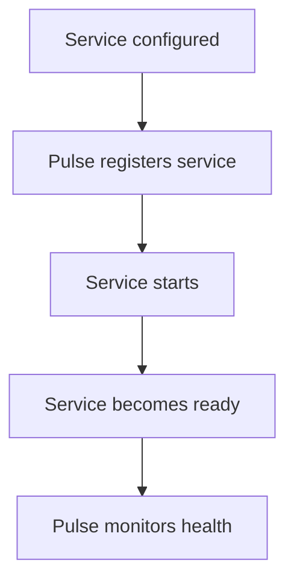
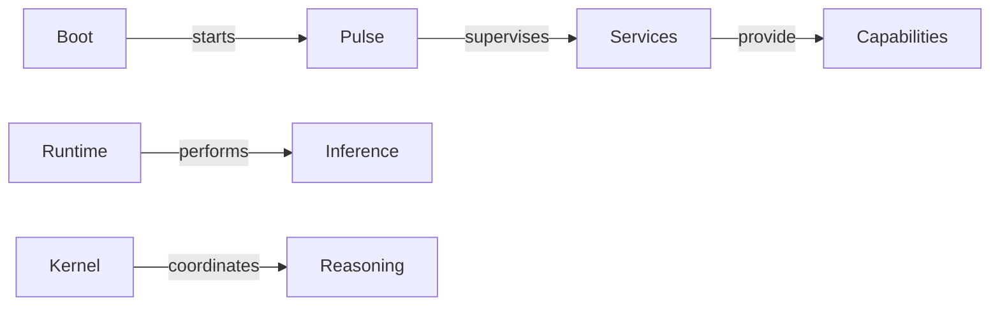
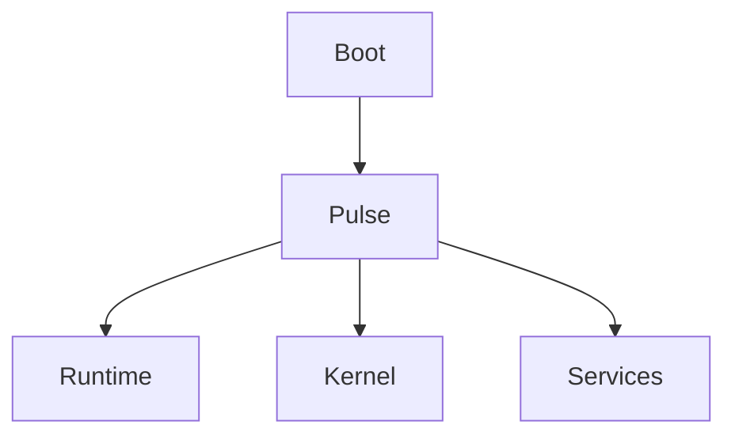
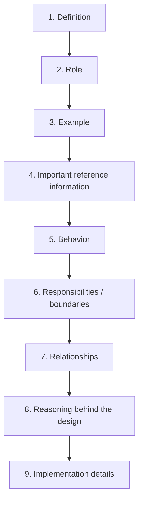
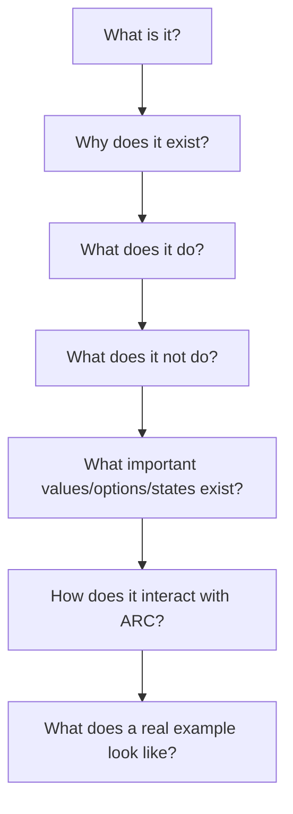
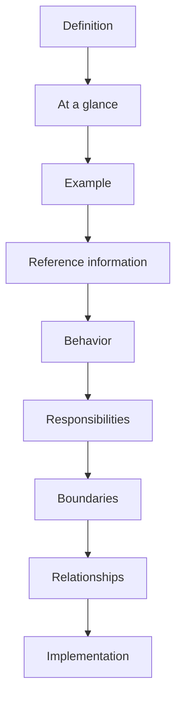

# ARC Concept Documentation Skill

> A documentation standard for writing concise, example-driven ARC V2 concept pages that render beautifully on GitHub and are easy for both humans and LLMs to understand.

> [!NOTE]
> This standard assumes concept pages live in a GitHub-rendered context (a repo README, wiki, or Markdown file viewed on GitHub/GitHub Enterprise). It uses GitHub-flavored Markdown features throughout — Mermaid diagrams, alert callouts, collapsible `<details>` blocks, and tables — instead of plain-text/ASCII diagrams.

## Purpose

ARC concept documentation describes **what a system concept is, what role it has, how it behaves, and how it relates to the rest of ARC**.

Concept pages are not implementation tutorials. They establish the architectural meaning, boundaries, important configuration, and practical usage of ARC concepts.

A reader or LLM should be able to quickly answer:

* What is this?
* What does it do?
* Where does it fit?
* What does it interact with?
* What does a typical example look like?
* What is it responsible for?
* What is it **not** responsible for?
* What important values, options, states, or configuration exist?

---

## Writing principles

### 1. Define before explaining

Start with a precise one-sentence definition, formatted as a Markdown blockquote so it stands out visually on GitHub.

```md
> A Service is an independently managed capability inside ARC.
```

Avoid starting with history, motivation, or implementation details.

### 2. Explain the role before the implementation

Describe the architectural responsibility first.

Prefer:

```md
Pulse supervises service lifecycle, readiness, health, and failure recovery.
```

over:

```md
Pulse uses ServiceManager and ServiceRegistry to call start_all().
```

Implementation details belong later unless they are essential to understanding the concept.

### 3. Show important information, not just explanations

A concept page should explicitly list **important reference information** when it is useful for understanding, configuring, or using the concept.

This can include:

* configuration values
* environment variables
* constants
* states or lifecycle stages
* public names or identifiers
* available options
* defaults
* important paths
* ports
* permissions
* events
* commands
* dependencies
* capability lists
* limits or thresholds

For example:

```md
| Variable | Default | Purpose |
|---|---:|---|
| `ARC_RUNTIME_PORT` | `7842` | Runtime server port |
| `ARC_RUNTIME_DEBUG` | `1` | Enable runtime debug mode |
```

Do not force exhaustive reference tables onto every concept. Include them when they materially improve understanding or make the page useful as a quick reference. If a reference table is long (more than ~15 rows), wrap it in a collapsible `<details>` block (see [Collapsible sections](#collapsible-sections) below) so it doesn't dominate the page.

### 4. Use diagrams to establish meaning

Every concept should contain at least one concrete ARC example, expressed as a **Mermaid diagram** rather than a plain-text/ASCII diagram.



Immediately explain what the example demonstrates.

Diagrams should show **relationships and behavior**, not merely syntax.

> [!IMPORTANT]
> Use Mermaid, not ASCII art, for every diagram in ARC concept pages. See [Architecture diagrams](#architecture-diagrams) for the diagram types to use and when.

### 5. State boundaries explicitly

Clearly distinguish what the concept does from what it does not do.

```md
### Responsibilities

- manages its own capability
- exposes lifecycle state
- reports readiness and health

### Not responsible for

- supervising other services
- deciding global startup order
- coordinating system-wide reasoning
```

This is especially important for LLM reasoning and architectural correctness.

### 6. Prefer precise, compact language

Use short paragraphs and meaningful headings.

Avoid:

* marketing language
* unnecessary history
* repetition
* vague statements such as "handles everything"
* implementation details without architectural relevance
* large walls of prose
* repeating reference information that could be represented more clearly as a table

A concept should be understandable by scanning the headings, tables, and diagrams alone.

---

# Standard concept-page structure

Use this structure as the default. Expand the block below to see the full annotated template.

<details>
<summary><strong>Concept page template (click to expand)</strong></summary>

````md
# Concept Name

> One-sentence definition.

## At a glance

| | |
|---|---|
| **Role** | ... |
| **Managed by** | ... |
| **Depends on** | ... |
| **Provides** | ... |
| **Status** | Implemented / Partial / Planned |

## What it does

Short explanation.

## Reference

Important values, names, options, states, configuration, or other
quick-reference information when relevant.

## Example



Explain the example.

## How it works

Explain the main lifecycle, flow, or interaction — as a Mermaid diagram
plus a short explanation of each step.

## Responsibilities

* ...
* ...

## Not responsible for

* ...
* ...

## Why it exists

Explain the architectural reason for the abstraction.

## Related concepts

* [Concept](./CONCEPT.md)
* [Concept](./CONCEPT.md)
````

</details>

Sections may be omitted when irrelevant. The structure is a guide, not a rigid checklist.

---

# The reference-information rule

Concept pages should serve as both **conceptual documentation and practical reference** when appropriate.

Ask:

> Is there information a developer or LLM would likely need to look up while understanding or using this concept?

If yes, include it directly in the concept page.

Prefer compact reference formats:

### Configuration

```md
| Variable | Default | Purpose |
|---|---|---|
| `LOG_LEVEL` | `INFO` | Logging verbosity |
```

### States

Use a Mermaid `stateDiagram-v2` instead of a plain arrow chain — it renders as a real state machine on GitHub:



### Options

```md
| Option | Meaning |
|---|---|
| `always` | Always restart |
| `on-failure` | Restart after failure |
| `never` | Do not restart |
```

### Constants

```md
| Constant | Purpose |
|---|---|
| `ARC_DIR` | ARC installation root |
| `AGENT_WORKSPACE` | Agent workspace |
```

### Commands or APIs

Use a compact example when the command itself is important to understanding the concept. If several commands or a long API surface need documenting, put them in a collapsible block:

<details>
<summary>Full command reference</summary>

```md
| Command | Purpose |
|---|---|
| `arc pulse start` | Start the supervisor |
| `arc pulse status` | Show service status |
```

</details>

Do not create a separate API-style reference section merely for completeness. The information belongs in the concept when it helps answer **what this concept is and how it is used**.

---

# The "At a glance" rule

The beginning of every page should provide the highest-value information immediately.

A reader should be able to understand the concept without reading the entire page.

Use a compact table:

```md
| | |
|---|---|
| **Role** | Service supervision |
| **Owns** | Lifecycle and process state |
| **Depends on** | Service configuration |
| **Provides** | Startup, health and failure handling |
| **Status** | Implemented |
```

Do not duplicate information later unless the later section adds meaning.

> [!TIP]
> Put the `Status` row's value in words (`Implemented`, `Partial`, `Planned`) rather than a badge/shield image. Badges pull from external services, add a dependency, and rarely add clarity for a single internal status value — plain text keeps the page self-contained. See [Status and evolving architecture](#status-and-evolving-architecture).

---

# Architecture diagrams

Use **Mermaid diagrams** — never plain-text/ASCII art — whenever relationships are important. GitHub renders Mermaid natively in Markdown files, so diagrams show up as real boxes, arrows, and shapes instead of monospace characters that break outside a fixed-width font.

Diagrams should answer one question:

> How does this concept fit into ARC?

Keep diagrams small enough to understand at a glance — a handful of nodes, not a full system map.

### Choosing a diagram type

| Situation | Mermaid diagram type |
|---|---|
| A concept owns/contains other concepts | `flowchart TD` (top-down tree) |
| A directional chain of ownership or calls | `flowchart LR` (left-right chain) |
| A lifecycle or set of named states | `stateDiagram-v2` |
| A sequence of calls between concepts over time | `sequenceDiagram` |
| Data/entity relationships | `erDiagram` |

### Containment example


### Ownership chain example



---

# Behavioral examples

When explaining behavior, show the flow as a Mermaid flowchart, then explain each meaningful transition underneath.



Then explain each meaningful transition, e.g.:

* **Service configured → Pulse registers service** — Pulse reads the service's configuration and adds it to the registry.
* **Pulse registers service → Service starts** — Pulse invokes the service's `start()` lifecycle hook.
* **Service starts → Service becomes ready** — the service reports readiness once its dependencies are available.
* **Service becomes ready → Pulse monitors health** — Pulse begins periodic health checks.

Do not describe behavior only in abstract terms when a short diagram can demonstrate it.

---

# LLM-oriented terminology

Use the same term consistently throughout the documentation.

For every important concept, make its semantic identity explicit:

```md
**Term:** Service

**Definition:** An independently managed capability inside ARC.

**Role:** Provides one system capability.

**Lifecycle:** registered → created → starting → ready → running → stopping → stopped

**Managed by:** Pulse
```

Do not use several names for the same concept unless ARC explicitly defines them as different concepts.

For example, do not alternate between:

```text
service
worker
component
module
process
```

when referring to the same ARC abstraction.

> [!WARNING]
> Inconsistent terminology is one of the most common causes of incorrect LLM reasoning about ARC's architecture. If a synonym slips into a page, fix it — don't add it as an accepted alternative.

---

# Relationships

When a concept interacts with another concept, describe the relationship explicitly.

Use:

```md
### Relationship with Pulse

Pulse supervises the Service lifecycle.

The Service does not supervise Pulse.
```

For directional relationships involving three or more concepts, use a Mermaid diagram instead of arrow-in-text notation:



This helps both developers and LLMs distinguish ownership, dependency, and communication at a glance.

---

# Collapsible sections

Use a `<details>`/`<summary>` block to hide content that is useful but not essential to a first read — long reference tables, full API surfaces, verbose examples, or historical/implementation notes. This keeps the page scannable while still making the information easy to find.

```md
<details>
<summary>Full environment variable reference</summary>

| Variable | Default | Purpose |
|---|---|---|
| `ARC_RUNTIME_PORT` | `7842` | Runtime server port |
| `ARC_RUNTIME_DEBUG` | `1` | Enable runtime debug mode |
| `ARC_LOG_LEVEL` | `INFO` | Logging verbosity |

</details>
```

Guidelines:

* Use collapsibles for **optional depth**, not for core content — the definition, "At a glance" table, and primary example should never be hidden.
* A good rule of thumb: if a table or code block is longer than ~15 lines, consider collapsing it.
* Give the `<summary>` a specific label (`Full command reference`, not `More info`) so a scanning reader knows whether to expand it.
* Don't nest collapsibles — one level is enough for concept pages.

---

# GitHub alert callouts

Use GitHub's built-in alert syntax to flag information that needs to stand out, instead of bold text or emoji. GitHub renders each of these with a distinct icon and color:

```md
> [!NOTE]
> Useful background or context that doesn't fit inline.

> [!TIP]
> A helpful suggestion for using the concept correctly.

> [!IMPORTANT]
> Information the reader must not miss to use the concept correctly.

> [!WARNING]
> A likely source of mistakes, or a behavior that looks safe but isn't.

> [!CAUTION]
> Risk of breaking something or losing data if ignored.
```

| Alert | Use for |
|---|---|
| `[!NOTE]` | Background context, clarifications |
| `[!TIP]` | Suggested usage patterns |
| `[!IMPORTANT]` | Must-know facts for correct usage |
| `[!WARNING]` | Common mistakes, non-obvious gotchas |
| `[!CAUTION]` | Destructive or hard-to-reverse behavior |

> [!CAUTION]
> Don't overuse alerts. A page with five callouts trains readers to skim past all of them. Reserve alerts for information that genuinely needs to interrupt normal reading.

---

# Implementation boundary

Concept pages may contain implementation details, but only after the architectural behavior is established.

Good:

```md
## Implementation

ARC currently implements services using the `Service` abstraction.
Pulse creates and supervises service instances according to configuration.
```

Avoid beginning with class names, file paths, or APIs unless the page itself documents an implementation concept.

For implementation-specific information, link to the relevant development documentation.

---

# Code examples

Use code only when it clarifies the concept, and always use fenced code blocks with a language tag so GitHub applies syntax highlighting.

Good:

````md
```python
class MyService(Service):
    async def start(self): ...
```
````

Then explain what the example demonstrates.

Do not turn concept pages into API references. If more than one or two code examples are needed, put the rest in a collapsible block.

Concept pages explain:

```text
what + why + behavior + relationships + important reference information
```

Development pages explain:

```text
how to implement it
```

---

# Status and evolving architecture

ARC V2 is under active development.

When a concept is incomplete, explicitly distinguish its status using a GitHub alert:

```md
> [!WARNING]
> This concept is partially implemented. The documented behavior describes
> the intended ARC architecture.
```

Use clear terminology, consistently, both in the alert text and in the `Status` row of the "At a glance" table:

* **Implemented** — exists and is currently usable.
* **Partial** — foundation exists, but behavior is incomplete.
* **Planned** — intended architecture, not implemented yet.

Do not present planned behavior as already implemented.

---

# Cross-linking

Every concept should link to related concepts.

Use links to create an architectural graph:

```md
## Related concepts

- [Architecture](./ARCHITECTURE.md) — overall system structure
- [Pulse](./PULSE.md) — service supervision
- [Runtime](./RUNTIME.md) — model inference
- [Kernel](./KERNEL.md) — orchestration and reasoning
```

Link to a concept rather than repeating its complete explanation.

<details>
<summary>Optional: render the whole architecture graph as one diagram</summary>

For a top-level `ARCHITECTURE.md`, it can help to show the full concept graph in one Mermaid diagram, with each node linking to its concept page via a `click` directive:



> [!NOTE]
> `click` links only become clickable when Mermaid is rendered in an environment that supports interactivity. On GitHub's in-page renderer they currently display as a static diagram — keep the plain-text `Related concepts` list as the reliable, always-clickable fallback.

</details>

---

# Information priority

Write information in this order:



The more implementation-specific the information becomes, the further down the page it should normally appear.

Reference information may move earlier when it is essential to understanding or operating the concept.

---

# Quality criteria

An ARC concept page is successful when a developer or LLM can quickly determine:



A good page is:

**Concise** — no unnecessary prose.

**Concrete** — diagrams and examples show the architecture.

**Referenceable** — important names, defaults, states, options, and values are easy to find.

**Consistent** — ARC terminology is used precisely.

**Bounded** — responsibilities and non-responsibilities are clear.

**Linked** — related concepts form a navigable architecture.

**LLM-readable** — definitions, relationships, behavior, boundaries, and important facts are explicit rather than implied.

---

# Canonical style

ARC concept documentation should feel like an **architecture reference**, not a marketing page and not an API manual.

Use this pattern:



The reader should be able to stop after any section and still have gained a useful, accurate piece of the ARC architecture.

---

# GitHub-rendering checklist

Before publishing a concept page, confirm:

- [ ] Definition is a `>` blockquote, not plain text
- [ ] "At a glance" table is present and includes a `Status` row
- [ ] Every diagram is Mermaid (` ```mermaid `), not ASCII art
- [ ] Long tables or command references are wrapped in `<details>`
- [ ] Status caveats use `[!WARNING]` or `[!NOTE]`, not bold text
- [ ] Code blocks have a language tag for syntax highlighting
- [ ] Terminology is consistent with other ARC pages
- [ ] "Related concepts" links point to real files with relative paths