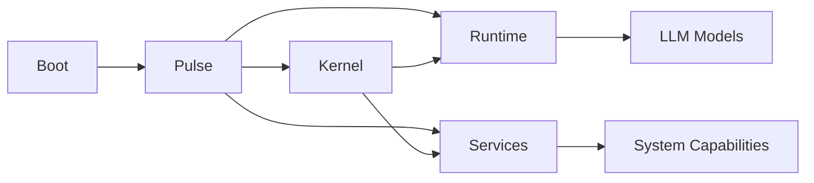

# ARC V2

<div align="center">

<!-- ARC ICON / LOGO SLOT -->

<!-- Replace with ARC HTML/SVG icon -->

### A persistent, agent-based AI system for Linux.

**Local inference · service-oriented · event-driven · persistent by design**


</div>

---

## Overview

ARC V2 is a **Linux-native AI system designed as a persistent environment for an agent**, rather than a conventional request/response chatbot.

Its architecture separates **system boot, service supervision, agent orchestration, model inference, and system capabilities** into distinct components.

The long-term goal is an assistant that can **remember, plan, act, react to events, and operate proactively** within its environment.



---

## Architecture

| Component    | Responsibility                                                             |
| ------------ | -------------------------------------------------------------------------- |
| **Boot**     | Initializes ARC and starts the system                                      |
| **Pulse**    | Supervises service lifecycle, dependencies, readiness, health and recovery |
| **Kernel**   | Agent orchestration, context, planning, memory and task coordination       |
| **Runtime**  | Model loading, inference and LLM execution                                 |
| **Services** | Independent capabilities exposed to the ARC system                         |

> [!NOTE]
> **Kernel and Runtime are Services themselves.** Pulse manages them through the same service lifecycle used by other ARC components.

### Core principle

> **The Kernel decides what should happen. The Runtime performs model inference. Services provide capabilities. Pulse keeps everything alive.**

This separation allows ARC to evolve without coupling the agent's reasoning system to a specific model backend or system capability.

---

## Current Status

> [!WARNING]
> ARC V2 is in **early active development**. The boot and service foundation are functional, while the higher-level agent system is still under development.

| Area                 | Status |
| -------------------- | :----: |
| Boot foundation      |    ✅   |
| Service abstraction  |    ✅   |
| Service registry     |    ✅   |
| Service lifecycle    |    ✅   |
| Dependency handling  |    ✅   |
| Pulse supervision    |    ✅   |
| Runtime service      |   🚧   |
| Kernel orchestration |   🚧   |
| Persistent memory    |   🧭   |
| Planning system      |   🧭   |
| Proactive behavior   |   🧭   |

**Legend:** ✅ Implemented · 🚧 In development · 🧭 Planned

---

## Technology

| Category      | Stack                             |
| ------------- | --------------------------------- |
| Language      | Python 3.11+                      |
| Tooling       | uv                                |
| CLI           | Cyclopts                          |
| API           | FastAPI / Uvicorn                 |
| Inference     | llama.cpp / `llama-cpp-python`    |
| Models        | GGUF                              |
| Configuration | YAML / `.env`                     |
| Scheduling    | Croniter                          |
| Integrations  | Telegram / OpenAI-compatible APIs |

For uv installation and usage, see the [official uv documentation](https://docs.astral.sh/uv/).


## Installation

### Development

Clone the repository and synchronize the project with uv:

```bash
git clone https://github.com/PauWol/ARC-V2.git
cd ARC-V2

uv sync
```

Run ARC:

```bash
uv run arc
```

or for dev without rebuilding

```bash
uv run python -m arc.boot.boot
```

Run tests:

```bash
uv run pytest
```

> [!WARNING]
> Tests are planned but not really enrolled.


### As a CLI Tool

Install ARC directly from GitHub:

```bash
uv tool install git+https://github.com/PauWol/ARC-V2.git
```

Then run:

```bash
arc
```

Update the installed version:

```bash
uv tool upgrade arc
```

For complete uv installation, project and tool documentation, see the [uv documentation](https://docs.astral.sh/uv/).

---

## Configuration

ARC uses environment-based configuration.

Configuration is documented in:

[`docs/CONSTANTS.md`](./docs/CONSTANTS.md)

Example:

```env
ARC_DIR=~/arc
AGENT_WORKSPACE=~/arc/workspace
LLM_MODEL_STORE=~/arc/models
```

> [!IMPORTANT]
> Do not commit secrets or private configuration files to the repository.

---

## Documentation

ARC uses **concept documents** to describe the architecture and individual parts of the system.

[`docs/CONCEPTS.md`](./docs/CONCEPTS.md) defines the documentation standard used when creating concept pages. It describes how concepts should be structured so they remain useful to both **humans and LLMs**.

| Document                                   | Purpose                                 |
| ------------------------------------------ | --------------------------------------- |
| [`docs/CONCEPTS.md`](./docs/CONCEPTS.md)   | Standard for ARC concept documentation  |
| [`docs/SERVICES.md`](./docs/SERVICES.md)   | Service architecture and implementation |
| [`docs/CONSTANTS.md`](./docs/CONSTANTS.md) | Environment variables and configuration |

Additional concept documentation will be added as the corresponding ARC components mature.

---

## Contributing

ARC V2 is still establishing its architecture.

For significant architectural changes, open an issue first to discuss the direction. Documentation, tests and focused improvements are welcome.

---

## License

> [!WARNING]
> ARC V2 does not currently have a finalized open-source license. Until a `LICENSE` file is added, the repository should be treated as **all rights reserved**.

---

<div align="center">

**ARC V2**
*Building the foundation for a persistent AI agent.*

</div>
