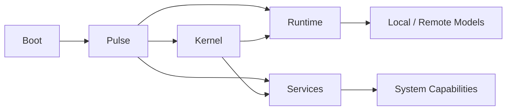
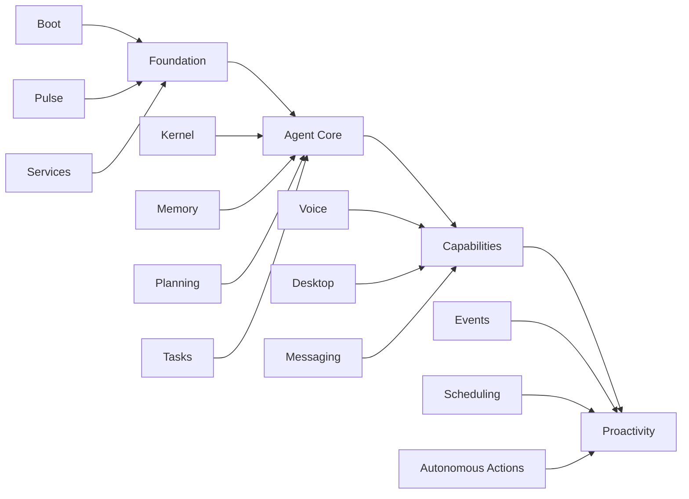

# ARC V2

<div align="center">

<!-- ARC ICON / LOGO SLOT -->

<!-- Replace with ARC HTML/SVG icon -->

### A persistent, agent-based AI system for Linux.

**Local inference · service-oriented · event-driven · persistent by design**


</div>

---

## Overview

ARC V2 is a **Linux-native AI system designed as an operating environment for a persistent agent**, rather than a conventional request/response chatbot.

ARC separates **agent intelligence, model inference, and system capabilities** into independently supervised services.

The long-term goal is an assistant that can **remember, plan, act, react to events, and operate proactively** within its environment.



## Architecture

| Component    | Responsibility                                                             |
| ------------ | -------------------------------------------------------------------------- |
| **Boot**     | Initializes ARC and starts the system                                      |
| **Pulse**    | Supervises service lifecycle, dependencies, readiness, health and recovery |
| **Kernel**   | Agent orchestration, context, planning, memory and task coordination       |
| **Runtime**  | Model loading, inference and LLM execution                                 |
| **Services** | Independent capabilities exposed to the ARC system                         |

> [!NOTE]
> **Kernel and Runtime are Services themselves.** Pulse manages them through the same service lifecycle used by other ARC components.

### Core principle

> **The Kernel decides what should happen. The Runtime performs model inference. Services provide capabilities. Pulse keeps everything alive.**

This separation allows ARC to evolve without coupling the agent's reasoning system to a specific model backend or system capability.

---

## Why ARC?

Traditional AI applications often follow:

```text
Input → Prompt → Model → Response
```

ARC is designed around a persistent system:

```text
Events
  ↓
Services
  ↓
Kernel
  ↓
Planning / Memory / Tasks
  ↓
Runtime
  ↓
Model
```

This makes **continuous operation, event-driven behavior and proactive execution** first-class architectural concepts.

---

## Current Status

> [!WARNING]
> ARC V2 is in **early active development**. The foundation is functional, while the higher-level agent system is still being built.

| Area                          | Status |
| ----------------------------- | :----: |
| Boot foundation               |    ✅   |
| Service abstraction           |    ✅   |
| Service registry              |    ✅   |
| Service lifecycle             |    ✅   |
| Dependency handling           |    ✅   |
| Pulse supervision             |    ✅   |
| Runtime service               |   🚧   |
| Kernel orchestration          |   🚧   |
| Persistent memory             |   🧭   |
| Planning system               |   🧭   |
| Proactive behavior            |   🧭   |
| Expanded interaction services |   🧭   |

**Legend:** ✅ Implemented · 🚧 In development · 🧭 Planned

---

## Technology Stack

| Layer                 | Technology                       |
| --------------------- | -------------------------------- |
| Language              | Python 3.11+                     |
| Packaging             | Hatch + `pyproject.toml`         |
| Environment / tooling | [uv](https://docs.astral.sh/uv/) |
| CLI                   | Cyclopts                         |
| API                   | FastAPI + Uvicorn                |
| LLM runtime           | `llama-cpp-python`               |
| Model format          | GGUF                             |
| API compatibility     | OpenAI-compatible interfaces     |
| Configuration         | YAML + `.env`                    |
| Scheduling            | Croniter                         |
| Integrations          | Telegram Bot API                 |

---

## Project Structure

```text
arc-v2/
├── src/
│   └── arc/
│       ├── boot/
│       ├── pulse/
│       ├── kernel/
│       ├── runtime/
│       ├── services/
│       └── cli/
├── docs/
├── tests/
├── pyproject.toml
├── uv.lock
└── README.md
```

> [!NOTE]
> The exact tree may evolve as ARC's service boundaries stabilize.

---

## Installation

### Prerequisites

* Linux
* Python 3.11+
* [`uv`](https://docs.astral.sh/uv/)

### Install uv

Official installer:

```bash
curl -LsSf https://astral.sh/uv/install.sh | sh
```

Then verify:

```bash
uv --version
```

See the [official uv installation guide](https://docs.astral.sh/uv/getting-started/installation/) for alternative installation methods.

---

## Development

Clone ARC and synchronize the development environment:

```bash
git clone https://github.com/PauWol/ARC-V2.git
cd ARC-V2

uv sync
```

Run ARC through the managed project environment:

```bash
uv run arc
```

Run tests:

```bash
uv run pytest
```

Run tests with coverage:

```bash
uv run pytest --cov
```

`uv sync` creates and maintains the project environment, while `uv run` executes commands against the synchronized environment.

### Editable development

The project is installed editable by default when synchronized, so source changes are reflected without repeatedly reinstalling the package.

---

## Install ARC as a CLI Tool

For using ARC without cloning the repository:

```bash
uv tool install git+https://github.com/PauWol/ARC-V2.git
```

Then:

```bash
arc
```

To update the installed tool:

```bash
uv tool upgrade arc
```

Check installed tools:

```bash
uv tool list
```

`uv tool install` installs applications into an isolated environment and exposes their executables through your user tool `PATH`.

> [!TIP]
> For a one-off execution directly from the repository, `uvx` can run a tool without permanently installing it.

---

## Configuration

ARC uses environment-based configuration, with project-specific configuration documented in:

[`docs/CONSTANTS.md`](./docs/CONSTANTS.md)

Example:

```env
ARC_DIR=~/arc
AGENT_WORKSPACE=~/arc/workspace
LLM_MODEL_STORE=~/arc/models
```

> [!IMPORTANT]
> Do not commit secrets or private configuration files to the repository.

---

## Documentation

| Document                                   | Description                             |
| ------------------------------------------ | --------------------------------------- |
| [`docs/CONCEPTS.md`](./docs/CONCEPTS.md)   | Documentation and architecture concepts |
| [`docs/SERVICES.md`](./docs/SERVICES.md)   | Service model and how to build services |
| [`docs/CONSTANTS.md`](./docs/CONSTANTS.md) | Environment variables and configuration |

Planned documentation:

`PULSE.md` · `RUNTIME.md` · `KERNEL.md` · `ARCHITECTURE.md` · `CONFIGURATION.md`

---

## Design Principles

**Service-oriented**
System capabilities are isolated into independently supervised services.

**Persistent**
ARC is designed to exist continuously rather than only during an individual interaction.

**Event-driven**
Events can become inputs to the system independently of direct user prompts.

**Inference-independent**
The Kernel should not depend on a particular model implementation.

**Local-first**
Local model execution is a first-class runtime target.

**Recoverable**
Pulse monitors service state and manages lifecycle and recovery.

---

## Roadmap



> [!WARNING]
> The roadmap describes intended architecture, not guaranteed release timelines.

---

## Contributing

ARC V2 is still establishing its architecture.

Before making large architectural changes, open an issue to discuss the direction. Smaller fixes, tests and documentation improvements are welcome.

---

## License

> [!WARNING]
> ARC V2 does not currently have a finalized open-source license. Until a `LICENSE` file is present, the repository should be treated as **all rights reserved**.

---

<div align="center">

**ARC V2**
*Building the operating environment for a persistent AI agent.*

</div>
