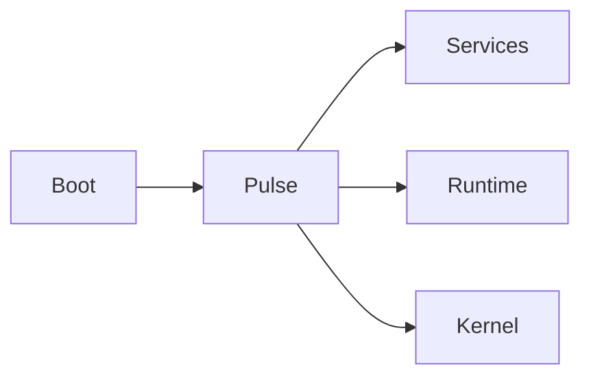

<div align="center">

<!-- ARC ICON / LOGO SLOT -->
<!-- Replace this block with your HTML/SVG icon -->

# ARC V2

### A persistent, agent-based assistant architecture.

**Local inference · service-oriented · event-driven · built for proactivity**

<br>


</div>

---

## Table of contents

- [ARC V2](#arc-v2)
    - [A persistent, agent-based assistant architecture.](#a-persistent-agent-based-assistant-architecture)
  - [Table of contents](#table-of-contents)
  - [Overview](#overview)
  - [Current status](#current-status)
  - [Core architecture](#core-architecture)
  - [Getting started](#getting-started)
    - [Requirements](#requirements)
  - [Documentation](#documentation)
  - [Contributing](#contributing)
  - [License](#license)

---

## Overview

ARC V2 is **not** a generic chat agent. It is being built as a **persistent assistant system** with a central kernel, a separate runtime inference backend, and an event-driven service architecture.

The goal is to move beyond simple `prompt → response` behavior and toward an assistant that can **remember, plan, act, react to events, and eventually operate proactively**.

## Current status

> [!WARNING]
> ARC V2 is in early development.
>
> The **core boot path and service foundation** are in place, but the higher-level assistant logic is still being built.

## Core architecture



* **Boot** starts the system
* **Pulse** supervises services — startup order, readiness, health, and failure recovery
* **Runtime** handles model inference
* **Kernel** will coordinate context, planning, memory, and tasks
* **Services** provide system capabilities, each as an independent process supervised by Pulse

> [!NOTE]
> Runtime and Kernel are themselves implemented as Services under Pulse — see [`docs/SERVICES.md`](./docs/SERVICES.md) for how a service is defined and supervised.

## Getting started

> [!WARNING]
> Setup instructions are not finalized yet — ARC V2 is still stabilizing its boot path. This section will be filled in with real install/run steps as that settles. In the meantime:

### Requirements

| Requirement | Version |
|---|---|
| Python | 3.11+ |

<details>
<summary>Planned setup steps (placeholder — not yet verified)</summary>

```bash
git clone <repo-url>
cd arc
cp .env.example ~/arc/.env   # see docs/CONSTANTS.md for available variables
# install + run instructions TBD
```

</details>

## Documentation

Concept docs describe what each part of ARC *is*, its responsibilities, and how it fits into the rest of the system — see [`docs/CONCEPTS.md`](./docs/CONCEPTS.md) for the documentation standard itself.

| Concept | Doc | Purpose |
|---|---|---|
| Services | [`docs/SERVICES.md`](./docs/SERVICES.md) | How to add your own Service |
| Environment Variables | [`docs/CONSTANTS.md`](./docs/CONSTANTS.md) | Runtime configuration via `~/arc/.env` |

> [!NOTE]
> Concept pages reference a few docs that aren't written yet (`PULSE.md`, `RUNTIME.md`, `KERNEL.md`, `ARCHITECTURE.md`, `CONFIGURATION.md`). Add rows here as those land so this table stays the single index.

## Contributing

> [!WARNING]
> Contribution guidelines aren't written yet. If you'd like to contribute before they land, open an issue first to discuss the change.

## License

> [!WARNING]
> License not yet chosen — treat this repository as all-rights-reserved until a `LICENSE` file is added.