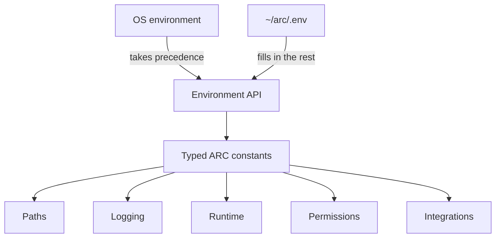

# Environment Variables

> ARC uses environment variables as its primary runtime configuration layer, with `~/arc/.env` providing local values and defaults.

## At a glance

|                       |                                                    |
| --------------------- | -------------------------------------------------- |
| **Role**              | Runtime configuration                              |
| **Source**            | OS environment + `~/arc/.env`                      |
| **Loaded by**         | ARC configuration layer                            |
| **Override behavior** | Existing environment variables are preserved       |
| **Provides**          | Paths, logging, runtime, permissions, integrations |
| **Status**            | Implemented                                        |

## What it does

Environment variables configure ARC without requiring deployment-specific values to be hard-coded into the application.

ARC looks for `~/arc/.env`. The file is loaded before configuration constants are evaluated.

> [!NOTE]
> If `~/arc/.env` does not exist, ARC continues using its defined defaults — no error is raised.

> [!IMPORTANT]
> `.env` values **do not** override variables already present in the OS environment. If a variable is set both in the shell and in `.env`, the shell value wins silently. This is a common source of "why isn't my `.env` change taking effect?" confusion — always check `env | grep <VAR>` first.

Values are read through typed helpers for strings, booleans, integers, floats, and paths.

## Reference

These are the environment variables currently defined by ARC.

### System

| Variable            | Default | Purpose                              |
| ------------------- | ------: | ------------------------------------ |
| `TERMINAL_NO_COLOR` |     `0` | Disable terminal colors when enabled |
| `PYTHONUNBUFFERED`  |     `1` | Run Python output without buffering  |

### Project directories

| Variable          | Default           | Purpose                                |
| ----------------- | ------------------ | --------------------------------------- |
| `ARC_DIR`         | `~/arc`            | Root directory of the ARC installation |
| `AGENT_WORKSPACE` | `~/arc/workspace`  | Persistent workspace used by the agent |
| `LLM_MODEL_STORE` | `~/arc/models`     | Directory containing local LLM models  |

### Model management

| Variable   | Default                           | Purpose                                    |
| ---------- | ---------------------------------- | ------------------------------------------- |
| `HF_TOKEN` | `YOUR-HUGGINGFACE-TOKEN-OPTIONAL`  | Optional Hugging Face authentication token |

### Logging

| Variable           |                     Default | Purpose                               |
| ------------------ | ---------------------------: | -------------------------------------- |
| `LOG_LEVEL`        |                      `INFO`  | Logging verbosity                     |
| `LOG_FILE`         | `~/arc/workspace/agent.log`  | Log file path                         |
| `LOG_CONSOLE`      |                         `1`  | Enable console logging                |
| `LOG_JSON`         |                         `0`  | Enable JSON-formatted logs            |
| `LOG_ROTATE`       |                         `1`  | Enable log rotation                   |
| `LOG_MAX_BYTES`    |                  `10485760`  | Maximum log-file size before rotation |
| `LOG_BACKUP_COUNT` |                         `2`  | Number of rotated log files to retain |

### Permissions

| Variable          | Default                        | Purpose                               |
| ----------------- | -------------------------------- | --------------------------------------- |
| `SANDBOX_ALLOW`   | `READ,WRITE,EXECUTE,NETWORK`   | Operations allowed inside the sandbox |
| `SANDBOX_CONFIRM` | `DELETE,SYSTEM,INSTALL`        | Operations requiring confirmation     |

### Agent runtime

| Variable                          |                                                                  Default | Purpose                                     |
| ---------------------------------- | -------------------------------------------------------------------------: | --------------------------------------------- |
| `EXTRACTOR_INPUT_TOKEN_THRESHOLD` |                                                                    `150`  | Token threshold used by the input extractor |
| `ARC_RUNTIME_PORT`                |                                                                   `7842`  | Runtime server port                         |
| `ARC_RUNTIME_DEBUG`               |                                                                      `1`  | Enable runtime debug mode                   |
| `ARC_RUNTIME_MODEL_PATH`          | `/home/paul/arc/models/unsloth__Qwen3.5-4B-GGUF/Qwen3.5-4B-Q4_K_M.gguf`  | Path to the runtime model                   |
| `ARC_RUNTIME_N_GPU_LAYERS`        |                                                                   `auto`  | Number of model layers assigned to the GPU  |
| `ARC_RUNTIME_N_THREADS`           |                                                                   `None`  | CPU thread configuration                    |
| `ARC_RUNTIME_N_CTX`               |                                                                   `4096`  | Model context size                          |
| `ARC_RUNTIME_N_BATCH`             |                                                                    `256`  | Inference batch size                        |
| `ARC_RUNTIME_EMBEDDING_POOLING`   |                                                            `unspecified` | Embedding pooling configuration             |
| `ARC_RUNTIME_GEN_TIMEOUT_S`       |                                                                  `120.0`  | Generation timeout in seconds               |
| `ARC_RUNTIME_VERBOSE`             |                                                                      `0`  | Enable verbose runtime output               |

### Telegram

| Variable             | Default            | Purpose                           |
| -------------------- | -------------------- | ----------------------------------- |
| `TELEGRAM_ENABLED`   | `0`                 | Enable Telegram integration       |
| `TELEGRAM_BOT_TOKEN` | `YOUR-BOT-TOKEN`    | Telegram bot authentication token |

## Example

A typical local `.env` might look like:

```env
ARC_DIR=~/arc
AGENT_WORKSPACE=~/arc/workspace
LLM_MODEL_STORE=~/arc/models

ARC_RUNTIME_PORT=7842
ARC_RUNTIME_N_CTX=4096
ARC_RUNTIME_N_BATCH=256

LOG_LEVEL=INFO
LOG_CONSOLE=1
LOG_JSON=0

TELEGRAM_ENABLED=0
```

ARC reads these values into typed configuration constants used throughout the system.

## How it works



ARC loads `.env` before evaluating configuration:

```python
ENV_LOADED = load_dot_env()
```

and uses `override=False`, preserving values already defined by the operating-system environment — matching the precedence shown above.

## Responsibilities

Environment variables are responsible for:

* configuring ARC at startup
* providing deployment-specific paths and settings
* configuring logging and runtime behavior
* enabling optional integrations
* controlling permission-related settings

The configuration layer can also update values stored in `~/arc/.env` through `set_env()`.

## Not responsible for

Environment variables are not:

* the service configuration system
* persistent application state
* the runtime API
* a replacement for service definitions

They are the **configuration input layer** from which ARC derives its runtime settings.

## Why it exists

Environment-based configuration lets the same ARC installation run with different models, paths, ports, logging settings, runtime settings, permissions, and integrations — without modifying source code.

## Related concepts

* [Services](./SERVICES.md) — services consume ARC configuration via `ctx.env`
* [Runtime](./RUNTIME.md) — model and inference configuration
* [Configuration](./CONFIGURATION.md) — broader ARC configuration model