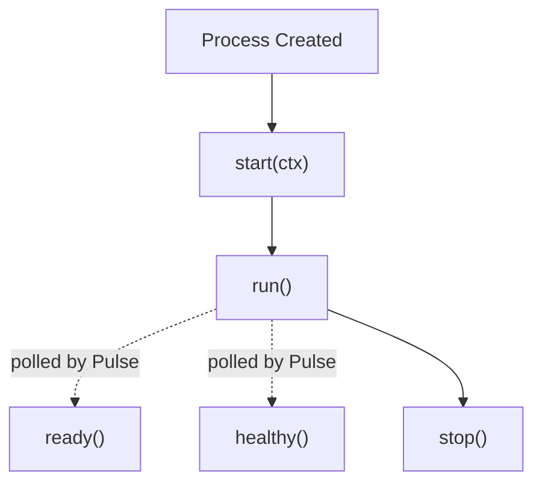

# ARC Services

> An ARC Service is an independent, long-running process managed by ARC Pulse.

## At a glance

|                |                                                              |
| -------------- | ------------------------------------------------------------ |
| **Role**       | Independent, long-running capability                         |
| **Managed by** | Pulse                                                         |
| **Depends on** | Other services, declared via `depends` in `services.arc.yaml` |
| **Provides**   | Isolated process, supervised lifecycle, readiness & health reporting |
| **Status**     | Implemented                                                   |

## What it does

Each service runs in its own isolated operating system process and is supervised by Pulse throughout its lifecycle. Services may depend on one another, allowing Pulse to start the system in dependency order and wait until required services become **ready** before starting dependent services.

> [!IMPORTANT]
> **Function-based services are no longer supported.** ARC previously supported services implemented as `async def start(ctx)`. This API has been removed. Every service must inherit from `Service`, so Pulse can monitor readiness and health, supervise failures, and coordinate dependency startup.

## Reference

### Service configuration

Services are registered in `services.arc.yaml`:

```yaml
services:
  runtime:
    module: arc.services.runtime.main
    restart: on-failure

  kernel:
    module: arc.services.kernel.main
    restart: always
    depends:
      - runtime
```

| Key | Meaning |
|---|---|
| `module` | Python module containing the `Service` subclass, e.g. `arc.services.runtime.main` → `arc/services/runtime/main.py`. Pulse auto-discovers the subclass inside it. |
| `restart` | Restart policy — see table below. |
| `depends` | List of services that must be started and become **ready** first. Services at the same dependency level start concurrently. |

**`restart` policies:**

| Value | Description |
|---|---|
| `always` | Restart whenever the service exits. |
| `on-failure` | Restart only after a crash or failure. |
| `never` | Never restart automatically. |

### Lifecycle methods

| Method | Purpose |
|---|---|
| `run()` | Main service execution. |
| `ready()` | Reports whether initialization has completed. |
| `healthy()` | Reports whether the service is operating correctly. |
| `stop()` | Performs a graceful shutdown. |

The framework provides `start()` automatically — service implementations only define the methods above. `start()` should never be overridden:

```python
async def start(self, ctx: BaseContext) -> None:
    self.ctx = ctx
    await self.run()
```

### `BaseContext`

Every service receives a shared execution context, injected by the base class before `run()` executes:

```python
@dataclass(slots=True)
class BaseContext:
    logger: Logger
    env: Mapping[str, str]
    service_name: str
    process_name: str
```

| Field | Purpose |
|---|---|
| `ctx.logger` | Service-specific logger managed by Pulse. Always use this instead of creating your own: `self.ctx.logger.info("Runtime started")` |
| `ctx.env` | Environment variables inherited from Pulse (see [Environment Variables](./CONSTANTS.md)). Services do not need to load `.env` files themselves: `model_path = self.ctx.env["LLM_MODEL_STORE"]` |
| `ctx.service_name` | Configured service name, e.g. `runtime`, `kernel`, `vision`. |
| `ctx.process_name` | OS process name assigned by Pulse. Useful for diagnostics. |

## Example

```python
from arc.foundation.service import Service


class MyService(Service): ...
```

<details>
<summary>Complete example: a minimal Pulse test service</summary>

```python
from __future__ import annotations

import asyncio

from arc.foundation.service import Service


class TestService(Service):
    def __init__(self) -> None:
        super().__init__(
            name="test",
            version="0.1.0",
            description="A simple Pulse test service",
        )

        self._stop_event = asyncio.Event()
        self._ready = False
        self._ticks = 0

    async def run(self) -> None:
        assert self.ctx is not None

        self.ctx.logger.info("Test service started")

        # Simulate startup work.
        await asyncio.sleep(1)

        self._ready = True
        self.ctx.logger.info("Test service ready")

        try:
            while not self._stop_event.is_set():
                self._ticks += 1
                self.ctx.logger.info("Tick %d", self._ticks)
                await asyncio.sleep(2)

        except asyncio.CancelledError:
            raise

        finally:
            self.ctx.logger.info("Test service stopped")

    async def stop(self) -> None:
        self._stop_event.set()

    async def ready(self) -> tuple[bool, str | None]:
        if self._ready:
            return True, None

        return False, "still starting"

    async def healthy(self) -> tuple[bool, str | None]:
        if self._stop_event.is_set():
            return False, "service is stopping"

        return True, None
```

</details>

## How it works



* **Process Created → `start(ctx)`** — Pulse creates the process and calls `start()`, which is provided by the framework and injects `ctx` before handing off to `run()`.
* **`run()`** — the service's main execution loop. It stays alive until shutdown.
* **`ready()`** (polled while `run()` is active) — reports whether startup has completed. Pulse waits until every dependency reports readiness before starting dependent services. Typical readiness conditions: model finished loading, HTTP server listening, database connected, worker pool initialized, caches populated.

  ```python
  async def ready(self) -> tuple[bool, str | None]:
      if self._ready:
          return True, None

      return False, "still starting"
  ```

* **`healthy()`** (polled while `run()` is active) — reports runtime health, distinct from startup progress. Typical health failures: disconnected database, failed worker thread, unloaded model, unrecoverable internal error.

  ```python
  async def healthy(self) -> tuple[bool, str | None]:
      if self._stop_event.is_set():
          return False, "service is stopping"

      return True, None
  ```

* **`run()` → `stop()`** — Pulse calls `stop()` for a graceful shutdown when the service should exit.

> [!TIP]
> Keep `ready()` and `healthy()` lightweight — Pulse may poll them frequently, so they should return quickly rather than doing real work.

## Responsibilities

Each service is responsible for:

* running its core logic inside `run()`
* reporting startup completion via `ready()`
* reporting runtime health via `healthy()`
* shutting down gracefully in `stop()`
* using the provided `ctx` for logging and environment access

## Not responsible for

A service is not responsible for:

* deciding global startup order — Pulse computes this from `depends`
* restarting itself — Pulse applies the configured `restart` policy
* loading `.env` files — values arrive pre-populated on `ctx.env`
* supervising other services

## Why it exists

Running each capability as an independently supervised process lets Pulse start the system in dependency order, restart failed services without affecting others, and monitor readiness and health uniformly — without every service reimplementing process management itself.

## Best practices

* Inherit from `Service` for every service implementation.
* Keep `run()` alive until shutdown.
* Store long-lived resources as instance attributes.
* Use `ready()` only to report startup completion.
* Use `healthy()` only to report runtime health.
* Keep `ready()` and `healthy()` lightweight; Pulse may poll them frequently.
* Use `ctx.logger` for all logging.
* Release resources gracefully in `stop()`.
* Avoid blocking the event loop during normal operation.
* Design services to be independent and restartable.

## Related concepts

* [Pulse](./PULSE.md) — supervises service lifecycle, readiness, health, and failure recovery
* [Environment Variables](./CONSTANTS.md) — source of `ctx.env`
* [Runtime](./RUNTIME.md) — an example service (model inference)